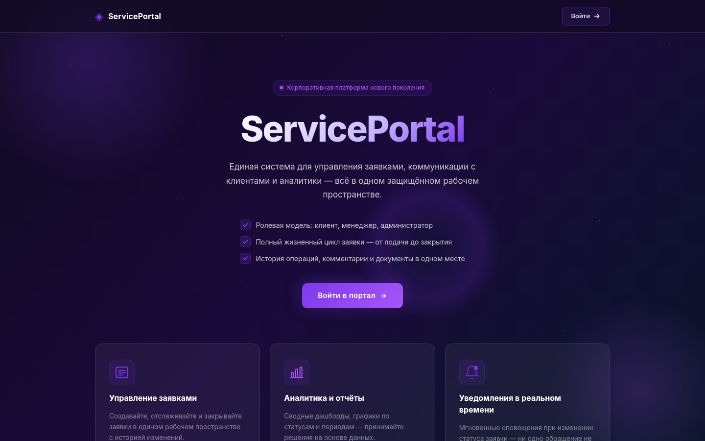

# 🚀 SaaS-портал для клиентов — канбан, live-уведомления и полный контроль в одном интерфейсе

> Личный кабинет, где клиент сам видит статус заявки, а менеджер больше не тонет в переписке. Заявки, документы, канбан-доска и аналитика — в одном месте, с обновлением в реальном времени.

## 💡 Что это

Веб-портал, где клиент создаёт заявки в поддержку, отслеживает их на канбан-доске и скачивает выданные документы, а менеджер и администратор обрабатывают обращения, назначают исполнителей и следят за нагрузкой через дашборд аналитики. Смена статуса и новый комментарий прилетают пользователю мгновенно через WebSocket — без перезагрузки страницы и без "обновите вручную".

## 🎯 Какую проблему решает

Сервисные компании и агентства годами ведут клиентов через почту и мессенджеры — и тонут в вопросах "что там с моей заявкой". Портал закрывает это одним каналом: клиент видит статус сам, не дёргая менеджера, а менеджер видит все заявки, комментарии и файлы в одном месте с разграничением по ролям. Меньше повторных вопросов, никакой потери документов в переписке.

## ⚙️ Ключевые возможности

- Регистрация и вход с JWT (access + refresh токены), восстановление пароля по email-ссылке
- Ролевая модель: `client` / `manager` / `admin` — у каждой роли свой набор маршрутов и API
- Заявки (тикеты) с жизненным циклом статусов `new → in_work → waiting_client → closed` (и `cancelled`), с комментариями и прикреплёнными файлами
- Канбан-доска с drag-and-drop переносом заявок между статусами (`@dnd-kit`)
- Раздел документов — менеджер загружает файлы клиенту, клиент их скачивает
- Live-уведомления через WebSocket (новый комментарий, смена статуса, назначение) с колокольчиком в интерфейсе
- Админ-панель: управление пользователями, все заявки с фильтрами и назначением менеджера
- Аналитика для manager/admin: распределение заявок по статусам, динамика обращений за 30 дней, нагрузка по менеджерам (графики на Recharts)
- Онбординг для новых пользователей и приветственные экраны
- Тёмная тема интерфейса на CSS custom properties

## 🛠 Как реализовано

**Backend:** FastAPI (async), SQLAlchemy 2.0 (async, asyncpg), PostgreSQL, JWT-авторизация через `python-jose`, хэширование паролей `passlib[bcrypt]`, загрузка файлов через `aiofiles`

**Frontend:** React 18 + Vite, React Router, канбан на `@dnd-kit/core` + `@dnd-kit/sortable`, графики на Recharts, анимации на Framer Motion, иконки Phosphor

**Инфраструктура:** Docker Compose (отдельные контейнеры frontend/backend), volume под загруженные файлы, nginx-прокси с SSL перед контейнерами, домен portal.swiftstream.ru

Архитектурные детали:
- Разделение доступа на уровне FastAPI-зависимостей (`require_role`/`get_current_user`) — единая точка проверки прав для всех защищённых эндпоинтов
- WebSocket-менеджер соединений (`ConnectionManager`) хранит live-подключения по `user_id` и рассылает события конкретным пользователям, а не всем подряд
- Уведомления пишутся в БД и одновременно пушатся в сокет одной функцией (`create_and_push`) — история не теряется, даже если пользователь офлайн
- Refresh-токены и сброс пароля вынесены в отдельные таблицы с TTL, а не хранятся в JWT-payload
- CORS и allowed origins настраиваются через переменные окружения, а не захардкожены

## ✅ В чём плюсы для заказчика

- Реальный WebSocket-слой, а не поллинг: уведомления рассылаются адресно по `user_id`, с самоочисткой отвалившихся соединений
- Аналитика считается SQL-агрегациями (`GROUP BY`, `func.count`) на стороне БД, а не вычитыванием всех записей в Python — быстро даже на росте данных
- Асинхронный стек целиком: FastAPI + SQLAlchemy async + asyncpg, без блокирующих вызовов в обработчиках
- Роли и доступ проверяются на бэкенде через переиспользуемую зависимость, а не только скрытием элементов на фронте — реальная защита, а не декорация
- Канбан-доска — не имитация, а рабочий drag-and-drop с обновлением статуса заявки на сервере

## 🔗 Демо

https://portal.swiftstream.ru

---

*Демо-проект для портфолио*
